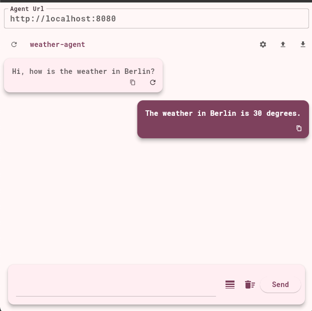

[](https://github.com/eclipse-lmos/arc-view/actions/workflows/build.yml)
[](https://www.apache.org/licenses/LICENSE-2.0)
[](CODE_OF_CONDUCT.md)

# Arc View

The Arc View is a UI application for communicating with an Arc Agent service.

The App is currently implemented to use the ARC Agent Graphql Endpoint described here https://eclipse-lmos.github.io/arc/docs/graphql.



The application is written in Flutter.

Uses: https://riverpod.dev/de/

## Setup

- Install Flutter -> https://docs.flutter.dev/get-started/install
- Run App
 ```
 flutter run 
```

## Development

Run the following command to ensure that code generation is active:

```
dart run build_runner watch
```

## Build

Run the following command to build the app for the web:

```
flutter build web --wasm --base-href=/chat/
```

## Code of Conduct

This project has adopted the [Contributor Covenant](https://www.contributor-covenant.org/) in version 2.1 as our code of conduct. Please see the details in our [CODE_OF_CONDUCT.md](CODE_OF_CONDUCT.md). All contributors must abide by the code of conduct.

By participating in this project, you agree to abide by its [Code of Conduct](./CODE_OF_CONDUCT.md) at all times.

## Licensing
Copyright (c) 2024 Deutsche Telekom AG.

Sourcecode licensed under the [Apache License, Version 2.0](https://www.apache.org/licenses/LICENSE-2.0) (the "License"); you may not use this project except in compliance with the License.

This project follows the [REUSE standard for software licensing](https://reuse.software/).    
Each file contains copyright and license information, and license texts can be found in the [./LICENSES](./LICENSES) folder. For more information visit https://reuse.software/.

Unless required by applicable law or agreed to in writing, software distributed under the License is distributed on an "AS IS" BASIS, WITHOUT WARRANTIES OR CONDITIONS OF ANY KIND, either express or implied. See the LICENSE for the specific language governing permissions and limitations under the License.